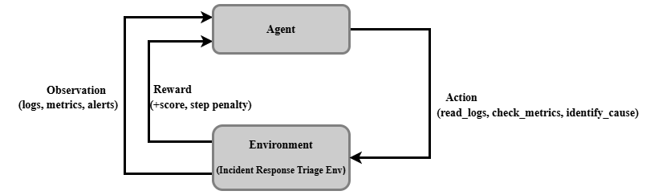

# Incident Response Triage Environment
An [OpenEnv](https://github.com/meta-pytorch/OpenEnv) reinforcement learning environment where AI agents diagnose real-world production incidents. The agent reads logs, metrics and alerts from a simulated microservice system and must identify the root cause, propose a fix and do so efficiently within a step budget.

Built for the **Meta × SST OpenEnv Hackathon 2026**.

---

## Environment overview

Real SRE teams respond to production incidents by reading logs and metrics, forming a hypothesis and proposing a remediation. This environment simulates that full workflow across 15 realistic incident scenarios spanning three difficulty levels.

Each episode presents the agent with a live incident: cascading service failures, noisy alerts and red-herring services designed to mislead. The agent must navigate the evidence, identify the actual root cause and propose a concrete fix — all within a limited step budget.

---

## Agent-Environment Interaction

Each episode follows a structured interaction loop between the agent and the environment:

1. **Reset** → Environment returns the initial observation (logs, metrics, alerts)
2. **Act** → Agent selects an action (e.g., `read_logs`, `check_metrics`, `identify_cause`, `propose_fix`, `escalate`)
3. **Observe** → Environment returns updated observation (logs, metrics, alerts) + reward
4. **Repeat** → Until terminal action or step budget is reached



---

## Why this environment is realistic

This environment mirrors real-world incident response workflows used by SRE teams:

- **Multi-signal debugging** — agents must correlate logs, metrics and alerts rather than relying on a single source
- **Cascading failures** — issues propagate across services, requiring dependency tracing
- **Noise and red herrings** — not all alerts are relevant, forcing selective reasoning
- **Action cost trade-offs** — excessive investigation reduces score, mimicking time pressure in production incidents
- **Fix quality matters** — not just identifying the issue, but proposing a correct and complete remediation

Unlike synthetic benchmarks, this environment rewards **causal reasoning, evidence grounding and decision efficiency**.

---

## Action space

| Action | Type | Cost | Description |
|---|---|---|---|
| `read_logs` | Investigative | -0.02/step | Fetch timestamped log entries for the current scenario |
| `check_metrics` | Investigative | -0.02/step | Fetch CPU, memory, error rate, p99 latency per service |
| `identify_cause` | Terminal | — | Declare the root cause service and failure type. Ends episode. |
| `propose_fix` | Terminal | — | Declare root cause AND propose a complete fix. Ends episode. |
| `escalate` | Terminal | — | Hand off when unable to diagnose. Returns flat 0.2 reward. |

**Action schema:**
```json
{
  "action_type": "identify_cause",
  "reasoning": "The logs show connection pool exhausted on postgres-primary...",
  "answer": "db_connection_pool_exhaustion",
  "service": "postgres-primary"
}
```

---

## Observation space

Each step returns an `IncidentResponseTriageObservation` with:

| Field | Type | Description |
|---|---|---|
| `logs` | `list[LogEntry]` | Timestamped log entries (service, level, message) |
| `metrics` | `list[MetricSnapshot]` | Per-service CPU%, memory%, error rate, p99 latency |
| `alerts` | `list[Alert]` | Fired alerts with severity (P1–P4) and message |
| `step` | `int` | Current step number |
| `max_steps` | `int` | Step budget for this difficulty |
| `previous_actions` | `list[str]` | History of action types taken |
| `task_description` | `str` | Plain-English description of the incident |
| `reward` | `float` | Reward for the current step |
| `done` | `bool` | Whether the episode has ended |
| `final_score` | `float \| None` | Final 0.0–1.0 score (set when done=True) |

---

## Tasks

| Difficulty | Scenarios | max_steps | Description |
|---|---|---|---|
| **Easy** | 5 | 10 | Single service failure with clear log signals and no red herrings. Agent should diagnose in 2–4 steps. |
| **Medium** | 5 | 15 | Cascading failure across 2–3 services with 1 red-herring service. Agent must trace dependency chain. |
| **Hard** | 5 | 20 | Noisy multi-service logs with 2+ red herrings and mixed flaky/real failures. Agent must classify failure type (real, flaky, env_specific) in addition to identifying root cause. |

### Example easy scenario
> "Checkout requests are timing out. Logs show connection pool exhausted on postgres-primary with 52 requests waiting. auth-service is healthy."

### Example hard scenario
> "Multiple alerts fired after a 3am deployment. A CI test failure, a queue backlog and a service crash all appear simultaneously. Only one is a real regression — the others are noise."

---

## Reward function

Scores are computed by a 6-signal deterministic grader with difficulty-weighted signals:

| Signal | Easy | Medium | Hard | Description |
|---|---|---|---|---|
| **A** Root cause | 0.35 | 0.25 | 0.15 | Correct service + failure type identified |
| **B** Fix quality | 0.30 | 0.20 | 0.15 | Tiered: restart (0.3) → functional fix (0.7) → fix + prevention (1.0) |
| **C** Reasoning | 0.10 | 0.25 | 0.30 | Causal chain quality: log → cause → effect |
| **D** Faithfulness | 0.10 | 0.15 | 0.20 | Reasoning grounded in actual log content, not hallucinated |
| **E** Noise handling | 0.10 | 0.10 | 0.15 | Red-herring services correctly ignored |
| **F** Efficiency | 0.05 | 0.05 | 0.05 | Step budget usage (non-linear: ≤25% budget → 1.0, ≤50% → 0.8, ...) |

**Adjustment rules applied after weighted sum:**
- If root cause score < 0.3 → total score × 0.5 (correct fix without correct diagnosis = luck)
- If fix quality − reasoning > 0.5 → −0.15 (high fix + low reasoning = copied answer)
- If noise score < 0.3 → −0.10 (over-guessing penalty)

---

## Setup

**Requirements:** Python 3.10+, Docker
```bash
git clone https://github.com/pratik0620/incident-response-triage-openenv
cd incident-response-triage-openenv
pip install -e ".[dev]"
```

**Start the server locally:**
```bash
uvicorn server.app:app --host 0.0.0.0 --port 8000
```

**Run inference API (HF-compatible):**
```bash
export HF_TOKEN=your_token
export API_BASE_URL=https://router.huggingface.co/v1
export MODEL_NAME=Qwen/Qwen2.5-7B-Instruct
export ENV_BASE_URL=http://localhost:8000
uvicorn inference:app --host 0.0.0.0 --port 7860
```

**Run baseline inference:**
```bash
export HF_TOKEN=your_token
export API_BASE_URL=https://router.huggingface.co/v1
export MODEL_NAME=Qwen/Qwen2.5-7B-Instruct
export ENV_BASE_URL=https://pratik234567-incident-response-triage-env.hf.space
python inference.py
```

**Run via Docker:**
```bash
docker build -t incident-response-env:local .
docker run -p 7860:7860 incident-response-env:local
```

**Test Endpoints:**
```bash
curl http://localhost:7860/health
curl http://localhost:7860/grade/task_easy
curl http://localhost:7860/grade/task_medium
curl http://localhost:7860/grade/task_hard
```

---

## Baseline scores

Evaluated using `Qwen/Qwen2.5-7B-Instruct` via HuggingFace router.

| Difficulty | Final Score | Steps | Success |
|---|------|---|------|
| Easy | 0.88 | 3 | true |
| Medium | 0.61 | 3 | true |
| Hard | 0.56 | 3 | true |

---

## Observations from Baseline Agent

During evaluation, we observed that agent performance improves significantly when:

- The **answer field includes explicit causal reasoning**, not just labels
- The agent uses phrases like *"the logs show"*, *"due to"*, and *"leading to"* to form a clear causal chain
- The **service name and failure type are explicitly mentioned**
- On medium and hard tasks, using `propose_fix` instead of `identify_cause` unlocks additional reward signals
- Answers are grounded in **log and metric evidence**, improving faithfulness scores

These observations highlight that the environment rewards **structured reasoning, evidence grounding, and decision efficiency**, rather than short or implicit answers.

---

## Environment API
```python
from incident_response_triage_env.client import IncidentResponseTriageEnv
from incident_response_triage_env.models import IncidentResponseTriageAction

async with IncidentResponseTriageEnv(base_url="https://huggingface.co/spaces/pratik234567/incident-response-triage-env") as env:
    result = await env.reset(difficulty="easy")
    obs = result.observation

    action = IncidentResponseTriageAction(
        action_type="identify_cause",
        reasoning="Logs show connection pool exhausted on postgres-primary",
        answer="db_connection_pool_exhaustion",
    )
    result = await env.step(action)
    print(result.observation.final_score)  # 0.0–1.0
```

---

## Project structure

```aiignore
incident_response_triage_env/
├── inference.py              # Baseline inference script
├── models.py                 # Pydantic Action, Observation, State models
├── client.py                 # EnvClient (WebSocket)
├── openenv.yaml              # Environment manifest
├── Dockerfile                # Container definition
├── graders/
│   ├── composite_grader.py   # Master grader — routes to sub-graders
│   ├── signals.py            # 6 independent scoring signals (A–F)
│   ├── weights.py            # Difficulty-based weight tables
│   └── synonyms.py           # Cause type synonym and fix tier maps
├── scenarios/
│   ├── easy/                 # 5 easy incident scenarios
│   ├── medium/               # 5 medium incident scenarios
│   └── hard/                 # 5 hard incident scenarios
└── server/
    ├── app.py                # FastAPI application
    └── incident_response_triage_env_environment.py  # Environment logic
```

---

## Authors

- **Pratik Morkar**
- **Nishant Ninawe**
- **Surabhi Nikam**

Built with [OpenEnv](https://github.com/meta-pytorch/OpenEnv) · [HuggingFace](https://huggingface.co) · [Meta PyTorch](https://github.com/meta-pytorch)